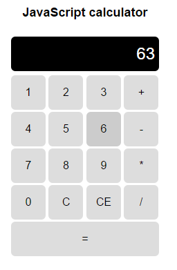

# JavaScript calculator
This simple on-screen calculator is an introductory exercise to the JavaScipt section of [The Odin Project](http://www.theodinproject.com), an open-source curriculum for learning web development with Ruby on Rails.

